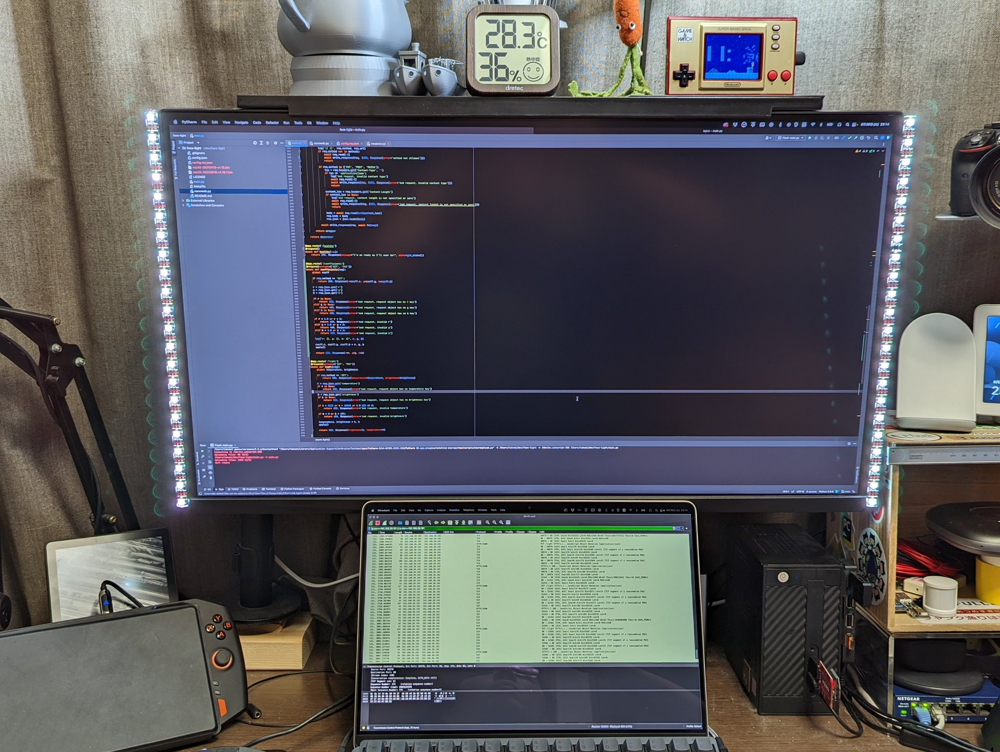
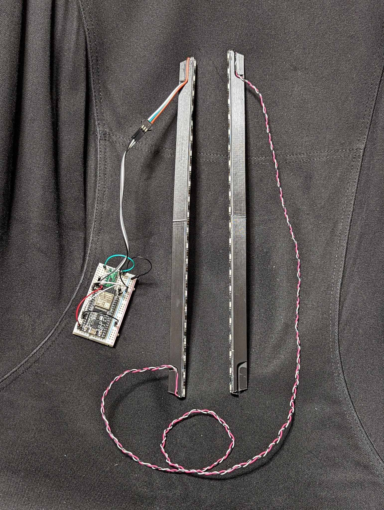

# Face Light

&nbsp;&nbsp;

3D-printed bars + NeoPixel LED strip + ESP32 + MicroPython = Face Light


### How to make yours

Prepare parts:

 - Open `face_light_bar.f3d`, adjust the length, and print it
   (A thin wooden bar basically does the same thing so you actually don't have to print it)
 - Any ESP32 module w/ USB-UART converter
 - Any NeoPixel(-compatible) LED strip
 - Level shifter between 3.3V -> 5V (for example: Fairchild Semiconductor FXMA108)

First, [install MicroPython on the ESP32 module](https://micropython.org/download/?port=esp32) (I tested it on MicroPython 1.15).

Fill the configuration file `config.json`.

 - `ssid`: your Wi-Fi AP's ESSID
 - `psk`: the pre-shared key (password)
 - `hostname`: ESP32's host name (advertised by mDNS)
 - `n_leds`: number of LEDs the strip has
 - `pin`: the pin number that the LED strip's DIN is connected to

After installing [ampy](https://github.com/scientifichackers/ampy), deploy the code and configuration.

```shell
ampy -p {serial_device} put main.py
ampy -p {serial_device} put nanoweb.py
ampy -p {serial_device} put config.json
```

Connect parts like:

 - ESP32 Vcc 3.3V -> Level shifter VA (Vdd of port A)
 - Vin (VBUS) 5V -> Level shifter VB (Vdd of port B)
 - Vin (VBUS) 5V -> LED strip Vin
 - ESP32 pin 12 -> Level shifter A0 (3.3V port bit 0)
 - Level shifter B0 (5V port bit 0) -> LED strip DIN
 - GND of everything

Send a request to turn the strip on. \
Note: If you're using Windows, you may not need the `.local` suffix in the URL.

```shell
curl -X PUT -H "Content-Type: application/json" -d '{"brightness": 255, "temperature": 6500}' http://face-light.local/light
```

Install the bar and the circuitry on your display! :tada:


### API reference

Call the REST API on port 80 to controll the LED strip.


#### /healthz

Returns a message.

Example response (pretty-printed):

```json
{
  "error": null,
  "message": "I'm as ready as I'll ever be!",
  "state": {
    "free": 56528
  }
}
```

 - `error` Optional[str]: error message
 - `message` str: passionate message from your ESP32
 - `state` -> `free` int: free memory in bytes


#### /coefficients (GET)

Get RGB coefficients.

Example response (pretty-printed):

```json
{
  "error": null,
  "r": 1.0,
  "g": 1.0,
  "b": 1.0
}
```

- `error` Optional[str]: error message
- `r` float: coefficient of R channel (0.0 <= r <= 1.0)
- `g` float: coefficient of G channel (0.0 <= g <= 1.0)
- `b` float: coefficient of B channel (0.0 <= b <= 1.0)


#### /coefficients (PUT)

Set RGB coefficients.

Example request (pretty-printed):

```json
{
  "r": 0.9,
  "g": 1.0,
  "b": 1.0
}
```

- `r` float: coefficient of R channel (0.0 <= r <= 1.0)
- `g` float: coefficient of G channel (0.0 <= g <= 1.0)
- `b` float: coefficient of B channel (0.0 <= b <= 1.0)


#### /light (GET)

Get the light's state.

Example response (pretty-printed):

```json
{
  "error": null,
  "brightness": 255,
  "temperature": 2400
}
```

- `error` Optional[str]: error message
- `brightness` int: brightness (0 <= b <= 255)
- `temperature` int: color temperature (2000 <= t <= 10000, must be a multiple of 100 like 2000, 2100, ...)


#### /light (PUT)

Set the light's state.

Example request (pretty-printed):

```json
{
  "brightness": 128,
  "temperature": 7000 
}
```

- `brightness` int: brightness (0 <= b <= 255)
- `temperature` int: color temperature (2000 <= t <= 10000, must be a multiple of 100 like 2000, 2100, ...)
